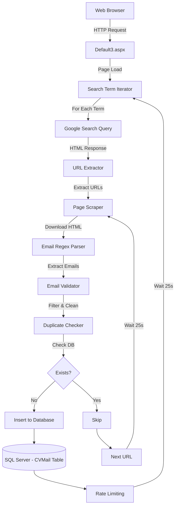
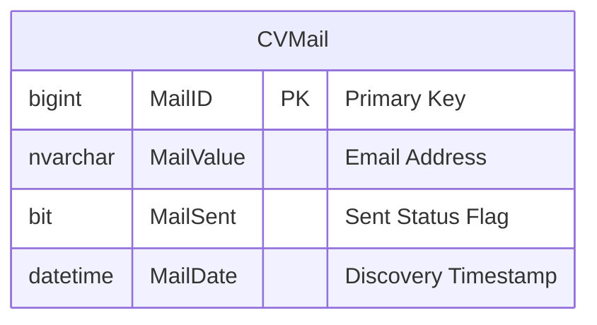
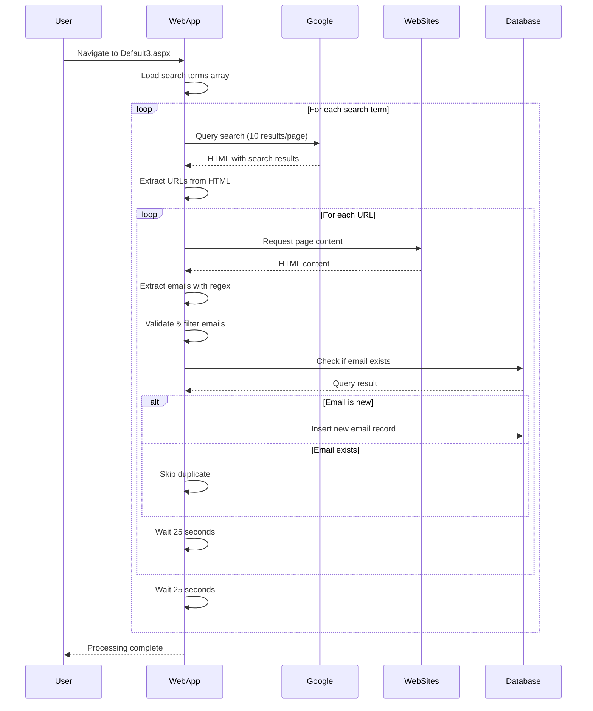

# CV Spider V1 (Google API)

An ASP.NET Web Forms application for automated web scraping and email extraction from Google search results. Built in January 2012 as a proof-of-concept for lead generation through search engine result page (SERP) scraping.

**⚠️ Historical Project**: This project uses deprecated techniques and should be considered a historical artifact. Modern implementations should use official APIs and comply with current web scraping best practices and legal requirements.

## Features

- 🔍 Automated Google search result scraping
- 📧 Email address extraction using regex patterns
- 💾 SQL Server database storage with duplicate detection
- 🔄 Rate limiting to prevent IP blocking
- 📊 LINQ-to-SQL ORM for data persistence
- 🌐 Multiple search term support
- ⏱️ Automatic delay mechanisms between requests

## Architecture Overview



## Database Schema



## Application Flow



## Getting Started

### Prerequisites

- Windows operating system
- .NET Framework 3.5 or higher
- SQL Server 2008+ (Express edition is sufficient)
- Visual Studio 2010+ or Visual Studio Community Edition
- Internet connection

### Installation

1. Clone the repository:
```bash
git clone https://github.com/orassayag/cv-spider-v1-google-api.git
cd cv-spider-v1-google-api
```

2. Set up the database:
```sql
CREATE DATABASE MistikaDB;
USE MistikaDB;

CREATE TABLE [dbo].[CVMail] (
    [MailID] BIGINT NOT NULL PRIMARY KEY,
    [MailValue] NVARCHAR(MAX) NULL,
    [MailSent] BIT NULL,
    [MailDate] DATETIME NULL
);
```

3. Update connection string in `web.config`:
```xml
<connectionStrings>
  <add name="MistikaDBConnectionString" 
       connectionString="Data Source=YOUR_SERVER\SQLEXPRESS;Initial Catalog=MistikaDB;Integrated Security=True"
       providerName="System.Data.SqlClient" />
</connectionStrings>
```

4. Open the project in Visual Studio
5. Build the solution (Ctrl+Shift+B)
6. Run the application (F5)

### Configuration

Edit search terms in `Default3.aspx.cs`:

```csharp
string[] lista = new string[]
{
    "your search term 1",
    "your search term 2",
    // Add more terms...
};
```

## Project Structure

```
cv-spider-v1-google-api/
├── App_Code/                    # Server-side code
│   ├── MistikaDB.dbml          # LINQ-to-SQL data model
│   ├── MistikaDB.dbml.layout   # Designer layout
│   └── MistikaDB.designer.cs   # Generated ORM code
├── Bin/                         # Binary dependencies
│   └── Newtonsoft.Json.dll     # JSON parsing library
├── Default3.aspx                # Main scraping page (UI)
├── Default3.aspx.cs             # Main scraping logic
├── DefaultGoogleApi.aspx        # Google API test page
├── DefaultGoogleApi.aspx.cs     # Google API logic
├── DefaultWriter.aspx           # Email sending page
├── DefaultWriter.aspx.cs        # Email sending logic
├── web.config                   # Application configuration
├── README.md                    # This file
├── INSTRUCTIONS.md              # Detailed setup guide
├── CONTRIBUTING.md              # Contribution guidelines
└── LICENSE                      # MIT License
```

## Built With

* [ASP.NET Web Forms](https://www.asp.net/web-forms) - Web framework
* [SQL Server](https://www.microsoft.com/sql-server) - Database
* [LINQ-to-SQL](https://docs.microsoft.com/en-us/dotnet/framework/data/adonet/sql/linq) - ORM framework
* [Newtonsoft.Json](https://www.newtonsoft.com/json) - JSON parsing
* [.NET Framework 3.5](https://dotnet.microsoft.com/) - Runtime environment

## How It Works

### Search and Scraping Process

1. **Search Query**: The application queries Google with predefined search terms
2. **Result Parsing**: Extracts URLs from the HTML response using regex
3. **Page Scraping**: Visits each URL and downloads the HTML content
4. **Email Extraction**: Uses regex to find email addresses in the page source
5. **Validation**: Filters out invalid emails (images, malformed addresses)
6. **Deduplication**: Checks database to avoid storing duplicate emails
7. **Storage**: Saves new unique emails to SQL Server
8. **Rate Limiting**: Waits 25 seconds between operations

### Email Extraction Regex

```regex
[a-z0-9!#$%&'*+/=?^_`{|}~-]+(?:\.[a-z0-9!#$%&'*+/=?^_`{|}~-]+)*@(?:[a-z0-9](?:[a-z0-9-]*[a-z0-9])?\.)+[a-z0-9](?:[a-z0-9-]*[a-z0-9])?
```

## Important Warnings

### ⚠️ Legal and Ethical Considerations

1. **Terms of Service**: Automated scraping of Google search results violates Google's Terms of Service
2. **Web Scraping Laws**: Check local laws regarding automated web scraping
3. **Data Privacy**: Comply with GDPR, CCPA, CAN-SPAM Act, and similar regulations
4. **Anti-Spam Laws**: Sending unsolicited emails may be illegal in many jurisdictions
5. **Website Terms**: Respect robots.txt and website terms of service
6. **Rate Limiting**: Aggressive scraping can be considered a DoS attack

### 🚨 Technical Limitations

1. **Outdated Methods**: Uses HTML scraping instead of official APIs
2. **IP Blocking**: Google may block your IP address
3. **CAPTCHA**: May trigger CAPTCHA challenges
4. **HTML Changes**: Google frequently changes their HTML structure
5. **Reliability**: Prone to breaking when Google updates their interface
6. **Performance**: Single-threaded, synchronous operations are slow

### 🔒 Security Considerations

1. **SQL Injection**: LINQ-to-SQL provides protection, but be cautious with raw queries
2. **Credentials**: Never commit database credentials to version control
3. **Error Handling**: Avoid exposing sensitive information in error messages
4. **Input Validation**: Validate and sanitize all user inputs
5. **HTTPS**: Use secure connections when possible

## Modern Alternatives

For new projects, consider these alternatives:

### Official APIs
- **Google Custom Search JSON API**: Legitimate Google search API
- **Bing Web Search API**: Microsoft's search API
- **SerpAPI**: Third-party SERP API service

### Web Scraping Frameworks
- **Scrapy** (Python): Robust web scraping framework
- **Puppeteer** (Node.js): Headless browser automation
- **Playwright** (Multiple languages): Modern browser automation
- **BeautifulSoup** (Python): HTML parsing library

### Email Finding Services
- **Hunter.io**: Professional email finding service
- **Clearbit**: B2B email enrichment
- **ZoomInfo**: Business contact database

## Contributing

Contributions to this project are [released](https://help.github.com/articles/github-terms-of-service/#6-contributions-under-repository-license) to the public under the [project's open source license](LICENSE).

Everyone is welcome to contribute. Contributing doesn't just mean submitting pull requests—there are many different ways to get involved, including answering questions and reporting issues.

Please read [CONTRIBUTING.md](CONTRIBUTING.md) for details on our code of conduct and the process for submitting pull requests.

## Versioning

We use [SemVer](http://semver.org/) for versioning. For the versions available, see the [tags on this repository](https://github.com/orassayag/cv-spider-v1-google-api/tags).

## Author

* **Or Assayag** - *Initial work* - [orassayag](https://github.com/orassayag)
* Or Assayag <orassayag@gmail.com>
* GitHub: https://github.com/orassayag
* StackOverflow: https://stackoverflow.com/users/4442606/or-assayag?tab=profile
* LinkedIn: https://linkedin.com/in/orassayag

## License

This application has an MIT license - see the [LICENSE](LICENSE) file for details.

## Acknowledgments

* Built in January 2012 as a learning project
* Demonstrates ASP.NET Web Forms and LINQ-to-SQL patterns
* Serves as a historical example of early 2010s web scraping techniques
* Not recommended for production use - use official APIs instead

## Disclaimer

This software is provided for educational and historical purposes only. The author does not condone or encourage:
- Violating website terms of service
- Sending unsolicited commercial emails (spam)
- Collecting personal data without proper consent
- Any illegal or unethical use of this software

Users are solely responsible for ensuring their use of this software complies with all applicable laws and regulations.
